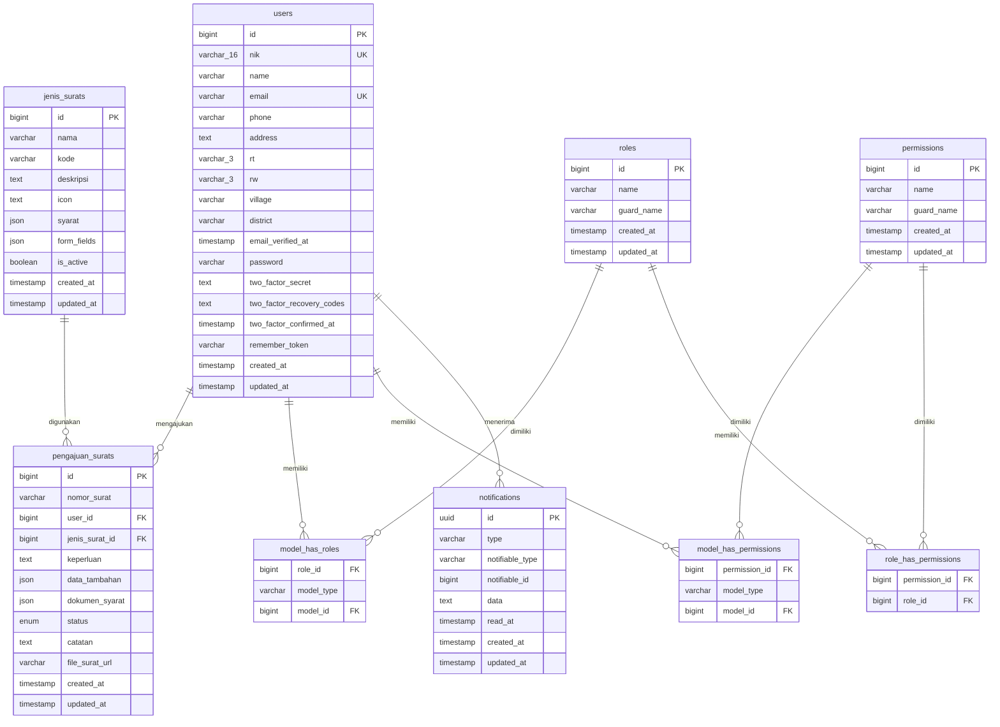
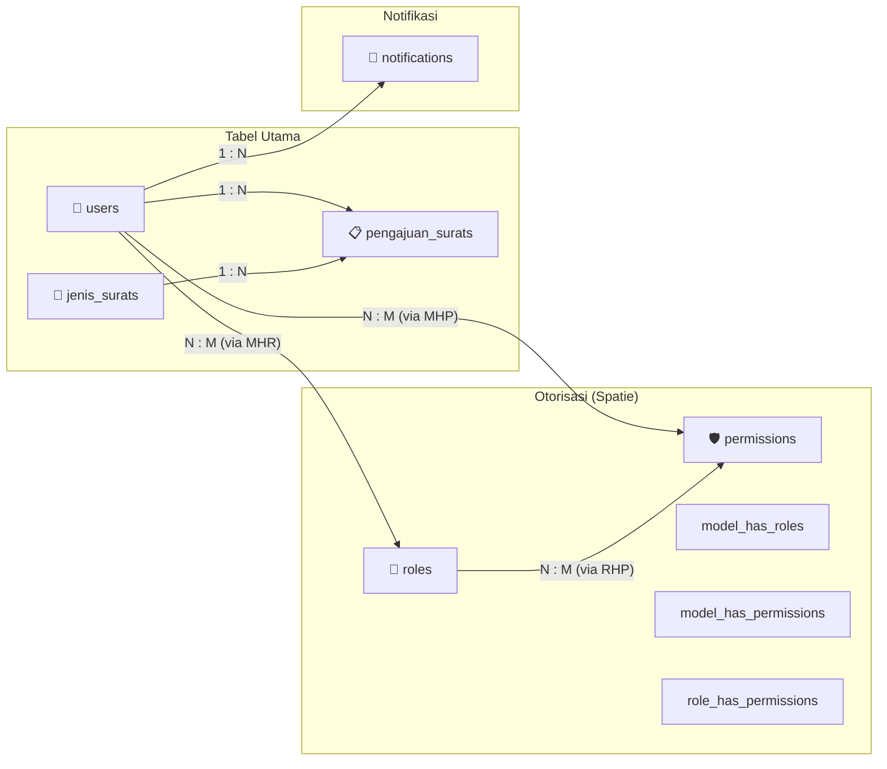

# Rancangan Tabel Database — SIMS Desa Pandak Daun
**Sistem Informasi Manajemen Surat (SIMS) Desa Pandak Daun**

> [!NOTE]
> Dokumen ini berisi rancangan seluruh tabel database berdasarkan file migration di folder [migrations](file:///d:/JOKI/M.RIYANDI/Aplikasi/database/migrations).

---

## Daftar Tabel

| # | Nama Tabel | Kategori | Deskripsi |
|---|------------|----------|-----------|
| 1 | `users` | Utama | Data pengguna (warga, staff, kepala desa) |
| 2 | `jenis_surats` | Utama | Master jenis surat yang tersedia |
| 3 | `pengajuan_surats` | Utama | Data pengajuan surat oleh warga |
| 4 | `roles` | Otorisasi | Daftar role (Spatie Permission) |
| 5 | `permissions` | Otorisasi | Daftar permission (Spatie Permission) |
| 6 | `model_has_roles` | Otorisasi | Pivot tabel user-role |
| 7 | `model_has_permissions` | Otorisasi | Pivot tabel user-permission |
| 8 | `role_has_permissions` | Otorisasi | Pivot tabel role-permission |
| 9 | `notifications` | Notifikasi | Notifikasi database untuk pengguna |
| 10 | `password_reset_tokens` | Autentikasi | Token reset password |
| 11 | `sessions` | Autentikasi | Session pengguna yang aktif |
| 12 | `cache` | Sistem | Cache data aplikasi |
| 13 | `cache_locks` | Sistem | Lock untuk cache (atomic locks) |
| 14 | `jobs` | Sistem | Antrian job (queue) |
| 15 | `job_batches` | Sistem | Batch job processing |
| 16 | `failed_jobs` | Sistem | Log job yang gagal |

---

## Entity Relationship Diagram (ERD)



---

## Detail Rancangan Setiap Tabel

---

### 1. Tabel `users`

**Deskripsi**: Menyimpan data seluruh pengguna sistem (warga, staff, kepala desa).

**Migration**: [0001_01_01_000000_create_users_table.php](file:///d:/JOKI/M.RIYANDI/Aplikasi/database/migrations/0001_01_01_000000_create_users_table.php) + [add_two_factor_columns](file:///d:/JOKI/M.RIYANDI/Aplikasi/database/migrations/2026_04_24_023227_add_two_factor_columns_to_users_table.php)

| # | Kolom | Tipe Data | Constraint | Deskripsi |
|---|-------|-----------|------------|-----------|
| 1 | `id` | BIGINT UNSIGNED | PRIMARY KEY, AUTO INCREMENT | ID unik pengguna |
| 2 | `nik` | VARCHAR(16) | UNIQUE, NOT NULL | Nomor Induk Kependudukan |
| 3 | `name` | VARCHAR(255) | NOT NULL | Nama lengkap pengguna |
| 4 | `email` | VARCHAR(255) | UNIQUE, NULLABLE | Alamat email |
| 5 | `phone` | VARCHAR(255) | NULLABLE | Nomor telepon / HP |
| 6 | `address` | TEXT | NULLABLE | Alamat lengkap |
| 7 | `rt` | VARCHAR(3) | NULLABLE | Nomor RT |
| 8 | `rw` | VARCHAR(3) | NULLABLE | Nomor RW |
| 9 | `village` | VARCHAR(255) | DEFAULT 'Pandak Daun' | Nama desa |
| 10 | `district` | VARCHAR(255) | NULLABLE | Nama kecamatan |
| 11 | `email_verified_at` | TIMESTAMP | NULLABLE | Waktu verifikasi email |
| 12 | `password` | VARCHAR(255) | NOT NULL | Password (hashed) |
| 13 | `two_factor_secret` | TEXT | NULLABLE | Secret key untuk 2FA |
| 14 | `two_factor_recovery_codes` | TEXT | NULLABLE | Kode recovery 2FA |
| 15 | `two_factor_confirmed_at` | TIMESTAMP | NULLABLE | Waktu konfirmasi 2FA |
| 16 | `remember_token` | VARCHAR(100) | NULLABLE | Token "remember me" |
| 17 | `created_at` | TIMESTAMP | NULLABLE | Waktu pembuatan |
| 18 | `updated_at` | TIMESTAMP | NULLABLE | Waktu update terakhir |

**Index**:
- PRIMARY KEY (`id`)
- UNIQUE (`nik`)
- UNIQUE (`email`)

---

### 2. Tabel `jenis_surats`

**Deskripsi**: Menyimpan master data jenis surat yang tersedia di desa.

**Migration**: [2026_04_24_032448_create_jenis_surats_table.php](file:///d:/JOKI/M.RIYANDI/Aplikasi/database/migrations/2026_04_24_032448_create_jenis_surats_table.php)

| # | Kolom | Tipe Data | Constraint | Deskripsi |
|---|-------|-----------|------------|-----------|
| 1 | `id` | BIGINT UNSIGNED | PRIMARY KEY, AUTO INCREMENT | ID unik jenis surat |
| 2 | `nama` | VARCHAR(255) | NOT NULL | Nama jenis surat (mis: Surat Keterangan Domisili) |
| 3 | `kode` | VARCHAR(255) | NULLABLE | Kode surat (mis: SKD, SKTM, SKU) |
| 4 | `deskripsi` | TEXT | NULLABLE | Deskripsi jenis surat |
| 5 | `icon` | TEXT | NULLABLE | SVG path icon untuk tampilan UI |
| 6 | `syarat` | JSON | NULLABLE | Daftar syarat dokumen (ktp, kk, pengantar_rt, foto_usaha) |
| 7 | `form_fields` | JSON | NULLABLE | Daftar field form dinamis [{name, label, type}] |
| 8 | `is_active` | BOOLEAN | DEFAULT TRUE | Status aktif/nonaktif jenis surat |
| 9 | `created_at` | TIMESTAMP | NULLABLE | Waktu pembuatan |
| 10 | `updated_at` | TIMESTAMP | NULLABLE | Waktu update terakhir |

**Index**:
- PRIMARY KEY (`id`)

**Contoh data kolom `syarat` (JSON)**:
```json
{
    "ktp": true,
    "kk": true,
    "pengantar_rt": false,
    "foto_usaha": false
}
```

**Contoh data kolom `form_fields` (JSON)**:
```json
[
    {"name": "tempat_lahir", "label": "Tempat Lahir", "type": "text"},
    {"name": "tanggal_lahir", "label": "Tanggal Lahir", "type": "date"},
    {"name": "pekerjaan", "label": "Pekerjaan", "type": "text"}
]
```

---

### 3. Tabel `pengajuan_surats`

**Deskripsi**: Menyimpan data setiap pengajuan surat yang diajukan warga.

**Migration**: [2026_04_24_032449_create_pengajuan_surats_table.php](file:///d:/JOKI/M.RIYANDI/Aplikasi/database/migrations/2026_04_24_032449_create_pengajuan_surats_table.php)

| # | Kolom | Tipe Data | Constraint | Deskripsi |
|---|-------|-----------|------------|-----------|
| 1 | `id` | BIGINT UNSIGNED | PRIMARY KEY, AUTO INCREMENT | ID unik pengajuan |
| 2 | `nomor_surat` | VARCHAR(255) | NULLABLE | Nomor surat resmi (diisi saat disetujui Kades) |
| 3 | `user_id` | BIGINT UNSIGNED | FOREIGN KEY → `users.id`, CASCADE DELETE | ID warga yang mengajukan |
| 4 | `jenis_surat_id` | BIGINT UNSIGNED | FOREIGN KEY → `jenis_surats.id`, CASCADE DELETE | ID jenis surat yang diajukan |
| 5 | `keperluan` | TEXT | NOT NULL | Tujuan / keperluan pengajuan surat |
| 6 | `data_tambahan` | JSON | NULLABLE | Data tambahan dari form dinamis |
| 7 | `dokumen_syarat` | JSON | NULLABLE | Path file dokumen yang diupload |
| 8 | `status` | ENUM | DEFAULT 'menunggu' | Status pengajuan |
| 9 | `catatan` | TEXT | NULLABLE | Catatan dari staff/kades (alasan penolakan) |
| 10 | `file_surat_url` | VARCHAR(255) | NULLABLE | URL file surat yang sudah jadi |
| 11 | `created_at` | TIMESTAMP | NULLABLE | Waktu pembuatan |
| 12 | `updated_at` | TIMESTAMP | NULLABLE | Waktu update terakhir |

**Index**:
- PRIMARY KEY (`id`)
- FOREIGN KEY (`user_id`) → `users(id)` ON DELETE CASCADE
- FOREIGN KEY (`jenis_surat_id`) → `jenis_surats(id)` ON DELETE CASCADE

**Nilai ENUM `status`**:

| Nilai | Deskripsi |
|-------|-----------|
| `menunggu` | Pengajuan baru masuk, belum diverifikasi staff |
| `diproses` | Sudah diverifikasi staff, menunggu persetujuan Kades |
| `selesai` | Disetujui Kades, nomor surat sudah di-generate |
| `ditolak` | Ditolak oleh staff atau Kades |

**Format `nomor_surat`**: `140/001/KODE/ROMAWI_BULAN/TAHUN`
- Contoh: `140/001/SKD/VI/2026`

**Contoh data kolom `data_tambahan` (JSON)**:
```json
{
    "tempat_lahir": "Banjarmasin",
    "tanggal_lahir": "1990-05-15",
    "pekerjaan": "Petani"
}
```

**Contoh data kolom `dokumen_syarat` (JSON)**:
```json
{
    "ktp": "pengajuan/ktp/abc123.jpg",
    "kk": "pengajuan/kk/def456.jpg"
}
```

---

### 4. Tabel `roles`

**Deskripsi**: Menyimpan daftar role pengguna (Spatie Permission).

**Migration**: [2026_04_24_023228_create_permission_tables.php](file:///d:/JOKI/M.RIYANDI/Aplikasi/database/migrations/2026_04_24_023228_create_permission_tables.php)

| # | Kolom | Tipe Data | Constraint | Deskripsi |
|---|-------|-----------|------------|-----------|
| 1 | `id` | BIGINT UNSIGNED | PRIMARY KEY, AUTO INCREMENT | ID unik role |
| 2 | `name` | VARCHAR(255) | NOT NULL | Nama role |
| 3 | `guard_name` | VARCHAR(255) | NOT NULL | Nama guard (default: 'web') |
| 4 | `created_at` | TIMESTAMP | NULLABLE | Waktu pembuatan |
| 5 | `updated_at` | TIMESTAMP | NULLABLE | Waktu update terakhir |

**Index**:
- PRIMARY KEY (`id`)
- UNIQUE (`name`, `guard_name`)

**Data default role**:

| name | guard_name | Deskripsi |
|------|------------|-----------|
| `warga` | web | Penduduk desa yang mengajukan surat |
| `staff` | web | Petugas administrasi desa |
| `kepala_desa` | web | Kepala Desa (pejabat penyetuju) |

---

### 5. Tabel `permissions`

**Deskripsi**: Menyimpan daftar permission/hak akses (Spatie Permission).

**Migration**: [2026_04_24_023228_create_permission_tables.php](file:///d:/JOKI/M.RIYANDI/Aplikasi/database/migrations/2026_04_24_023228_create_permission_tables.php)

| # | Kolom | Tipe Data | Constraint | Deskripsi |
|---|-------|-----------|------------|-----------|
| 1 | `id` | BIGINT UNSIGNED | PRIMARY KEY, AUTO INCREMENT | ID unik permission |
| 2 | `name` | VARCHAR(255) | NOT NULL | Nama permission |
| 3 | `guard_name` | VARCHAR(255) | NOT NULL | Nama guard (default: 'web') |
| 4 | `created_at` | TIMESTAMP | NULLABLE | Waktu pembuatan |
| 5 | `updated_at` | TIMESTAMP | NULLABLE | Waktu update terakhir |

**Index**:
- PRIMARY KEY (`id`)
- UNIQUE (`name`, `guard_name`)

---

### 6. Tabel `model_has_roles`

**Deskripsi**: Tabel pivot yang menghubungkan user dengan role.

| # | Kolom | Tipe Data | Constraint | Deskripsi |
|---|-------|-----------|------------|-----------|
| 1 | `role_id` | BIGINT UNSIGNED | FOREIGN KEY → `roles.id`, CASCADE DELETE | ID role |
| 2 | `model_type` | VARCHAR(255) | NOT NULL | Tipe model (App\Models\User) |
| 3 | `model_id` | BIGINT UNSIGNED | NOT NULL | ID model (user_id) |

**Index**:
- PRIMARY KEY (`role_id`, `model_id`, `model_type`)
- INDEX (`model_id`, `model_type`)
- FOREIGN KEY (`role_id`) → `roles(id)` ON DELETE CASCADE

---

### 7. Tabel `model_has_permissions`

**Deskripsi**: Tabel pivot yang menghubungkan user langsung dengan permission.

| # | Kolom | Tipe Data | Constraint | Deskripsi |
|---|-------|-----------|------------|-----------|
| 1 | `permission_id` | BIGINT UNSIGNED | FOREIGN KEY → `permissions.id`, CASCADE DELETE | ID permission |
| 2 | `model_type` | VARCHAR(255) | NOT NULL | Tipe model (App\Models\User) |
| 3 | `model_id` | BIGINT UNSIGNED | NOT NULL | ID model (user_id) |

**Index**:
- PRIMARY KEY (`permission_id`, `model_id`, `model_type`)
- INDEX (`model_id`, `model_type`)
- FOREIGN KEY (`permission_id`) → `permissions(id)` ON DELETE CASCADE

---

### 8. Tabel `role_has_permissions`

**Deskripsi**: Tabel pivot yang menghubungkan role dengan permission.

| # | Kolom | Tipe Data | Constraint | Deskripsi |
|---|-------|-----------|------------|-----------|
| 1 | `permission_id` | BIGINT UNSIGNED | FOREIGN KEY → `permissions.id`, CASCADE DELETE | ID permission |
| 2 | `role_id` | BIGINT UNSIGNED | FOREIGN KEY → `roles.id`, CASCADE DELETE | ID role |

**Index**:
- PRIMARY KEY (`permission_id`, `role_id`)
- FOREIGN KEY (`permission_id`) → `permissions(id)` ON DELETE CASCADE
- FOREIGN KEY (`role_id`) → `roles(id)` ON DELETE CASCADE

---

### 9. Tabel `notifications`

**Deskripsi**: Menyimpan notifikasi database untuk pengguna (Laravel Notification).

**Migration**: [2026_04_24_063652_create_notifications_table.php](file:///d:/JOKI/M.RIYANDI/Aplikasi/database/migrations/2026_04_24_063652_create_notifications_table.php)

| # | Kolom | Tipe Data | Constraint | Deskripsi |
|---|-------|-----------|------------|-----------|
| 1 | `id` | UUID | PRIMARY KEY | ID unik notifikasi |
| 2 | `type` | VARCHAR(255) | NOT NULL | Tipe notifikasi (class name) |
| 3 | `notifiable_type` | VARCHAR(255) | NOT NULL | Tipe model penerima (App\Models\User) |
| 4 | `notifiable_id` | BIGINT UNSIGNED | NOT NULL | ID model penerima (user_id) |
| 5 | `data` | TEXT | NOT NULL | Data notifikasi (JSON) |
| 6 | `read_at` | TIMESTAMP | NULLABLE | Waktu notifikasi dibaca |
| 7 | `created_at` | TIMESTAMP | NULLABLE | Waktu pembuatan |
| 8 | `updated_at` | TIMESTAMP | NULLABLE | Waktu update terakhir |

**Index**:
- PRIMARY KEY (`id`)
- INDEX (`notifiable_type`, `notifiable_id`)

**Tipe notifikasi yang digunakan**:

| Type | Deskripsi |
|------|-----------|
| `App\Notifications\PengajuanBaruNotification` | Notif ke staff/kades saat ada pengajuan baru |
| `App\Notifications\StatusPengajuanNotification` | Notif ke warga saat status pengajuan berubah |

---

### 10. Tabel `password_reset_tokens`

**Deskripsi**: Menyimpan token untuk fitur reset password.

| # | Kolom | Tipe Data | Constraint | Deskripsi |
|---|-------|-----------|------------|-----------|
| 1 | `email` | VARCHAR(255) | PRIMARY KEY | Email pengguna |
| 2 | `token` | VARCHAR(255) | NOT NULL | Token reset |
| 3 | `created_at` | TIMESTAMP | NULLABLE | Waktu pembuatan token |

**Index**:
- PRIMARY KEY (`email`)

---

### 11. Tabel `sessions`

**Deskripsi**: Menyimpan session pengguna yang sedang aktif (driver: database).

| # | Kolom | Tipe Data | Constraint | Deskripsi |
|---|-------|-----------|------------|-----------|
| 1 | `id` | VARCHAR(255) | PRIMARY KEY | Session ID |
| 2 | `user_id` | BIGINT UNSIGNED | NULLABLE, INDEX | ID pengguna (NULL jika guest) |
| 3 | `ip_address` | VARCHAR(45) | NULLABLE | IP address pengguna |
| 4 | `user_agent` | TEXT | NULLABLE | User agent browser |
| 5 | `payload` | LONGTEXT | NOT NULL | Data session (encrypted) |
| 6 | `last_activity` | INTEGER | INDEX | Timestamp aktivitas terakhir |

**Index**:
- PRIMARY KEY (`id`)
- INDEX (`user_id`)
- INDEX (`last_activity`)

---

### 12. Tabel `cache`

**Deskripsi**: Menyimpan data cache aplikasi (driver: database).

| # | Kolom | Tipe Data | Constraint | Deskripsi |
|---|-------|-----------|------------|-----------|
| 1 | `key` | VARCHAR(255) | PRIMARY KEY | Cache key |
| 2 | `value` | MEDIUMTEXT | NOT NULL | Cache value |
| 3 | `expiration` | BIGINT | INDEX | Waktu kadaluarsa (UNIX timestamp) |

**Index**:
- PRIMARY KEY (`key`)
- INDEX (`expiration`)

---

### 13. Tabel `cache_locks`

**Deskripsi**: Menyimpan atomic lock untuk operasi cache yang membutuhkan eksklusivitas.

| # | Kolom | Tipe Data | Constraint | Deskripsi |
|---|-------|-----------|------------|-----------|
| 1 | `key` | VARCHAR(255) | PRIMARY KEY | Lock key |
| 2 | `owner` | VARCHAR(255) | NOT NULL | Pemilik lock |
| 3 | `expiration` | BIGINT | INDEX | Waktu kadaluarsa lock |

**Index**:
- PRIMARY KEY (`key`)
- INDEX (`expiration`)

---

### 14. Tabel `jobs`

**Deskripsi**: Menyimpan antrian job yang belum diproses (Laravel Queue).

| # | Kolom | Tipe Data | Constraint | Deskripsi |
|---|-------|-----------|------------|-----------|
| 1 | `id` | BIGINT UNSIGNED | PRIMARY KEY, AUTO INCREMENT | ID job |
| 2 | `queue` | VARCHAR(255) | INDEX | Nama queue |
| 3 | `payload` | LONGTEXT | NOT NULL | Data payload job |
| 4 | `attempts` | SMALLINT UNSIGNED | NOT NULL | Jumlah percobaan eksekusi |
| 5 | `reserved_at` | INT UNSIGNED | NULLABLE | Waktu job di-reserve worker |
| 6 | `available_at` | INT UNSIGNED | NOT NULL | Waktu job available untuk diproses |
| 7 | `created_at` | INT UNSIGNED | NOT NULL | Waktu pembuatan |

**Index**:
- PRIMARY KEY (`id`)
- INDEX (`queue`)

---

### 15. Tabel `job_batches`

**Deskripsi**: Menyimpan data batch processing job.

| # | Kolom | Tipe Data | Constraint | Deskripsi |
|---|-------|-----------|------------|-----------|
| 1 | `id` | VARCHAR(255) | PRIMARY KEY | ID batch |
| 2 | `name` | VARCHAR(255) | NOT NULL | Nama batch |
| 3 | `total_jobs` | INTEGER | NOT NULL | Total job dalam batch |
| 4 | `pending_jobs` | INTEGER | NOT NULL | Jumlah job yang masih pending |
| 5 | `failed_jobs` | INTEGER | NOT NULL | Jumlah job yang gagal |
| 6 | `failed_job_ids` | LONGTEXT | NOT NULL | ID-ID job yang gagal |
| 7 | `options` | MEDIUMTEXT | NULLABLE | Opsi batch |
| 8 | `cancelled_at` | INTEGER | NULLABLE | Waktu batch dibatalkan |
| 9 | `created_at` | INTEGER | NOT NULL | Waktu pembuatan |
| 10 | `finished_at` | INTEGER | NULLABLE | Waktu batch selesai |

**Index**:
- PRIMARY KEY (`id`)

---

### 16. Tabel `failed_jobs`

**Deskripsi**: Menyimpan log job yang gagal dieksekusi untuk debugging.

| # | Kolom | Tipe Data | Constraint | Deskripsi |
|---|-------|-----------|------------|-----------|
| 1 | `id` | BIGINT UNSIGNED | PRIMARY KEY, AUTO INCREMENT | ID record |
| 2 | `uuid` | VARCHAR(255) | UNIQUE | UUID unik job |
| 3 | `connection` | TEXT | NOT NULL | Nama koneksi queue |
| 4 | `queue` | TEXT | NOT NULL | Nama queue |
| 5 | `payload` | LONGTEXT | NOT NULL | Data payload job |
| 6 | `exception` | LONGTEXT | NOT NULL | Detail error/exception |
| 7 | `failed_at` | TIMESTAMP | DEFAULT CURRENT_TIMESTAMP | Waktu job gagal |

**Index**:
- PRIMARY KEY (`id`)
- UNIQUE (`uuid`)

---

## Ringkasan Relasi Antar Tabel



| Relasi | Tabel Asal | Tabel Tujuan | Tipe | Foreign Key | On Delete |
|--------|-----------|-------------|------|-------------|-----------|
| Warga → Pengajuan | `users` | `pengajuan_surats` | One-to-Many | `user_id` | CASCADE |
| Jenis Surat → Pengajuan | `jenis_surats` | `pengajuan_surats` | One-to-Many | `jenis_surat_id` | CASCADE |
| User ↔ Role | `users` | `roles` (via `model_has_roles`) | Many-to-Many | `model_id`, `role_id` | CASCADE |
| User ↔ Permission | `users` | `permissions` (via `model_has_permissions`) | Many-to-Many | `model_id`, `permission_id` | CASCADE |
| Role ↔ Permission | `roles` | `permissions` (via `role_has_permissions`) | Many-to-Many | `role_id`, `permission_id` | CASCADE |
| User → Notification | `users` | `notifications` | Polymorphic One-to-Many | `notifiable_id` | — |
