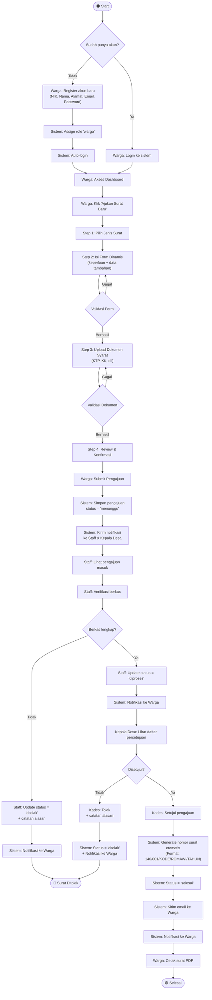
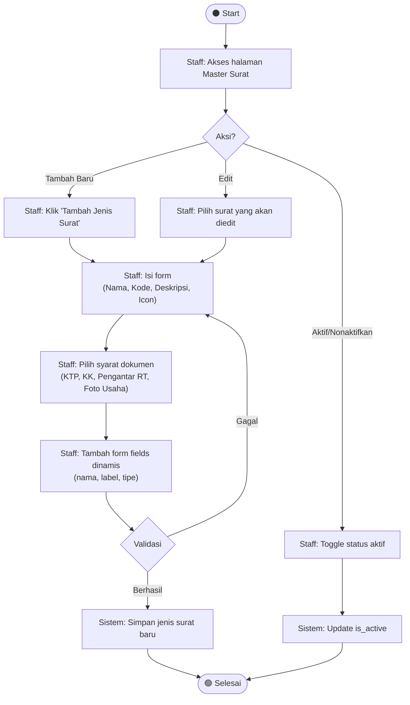
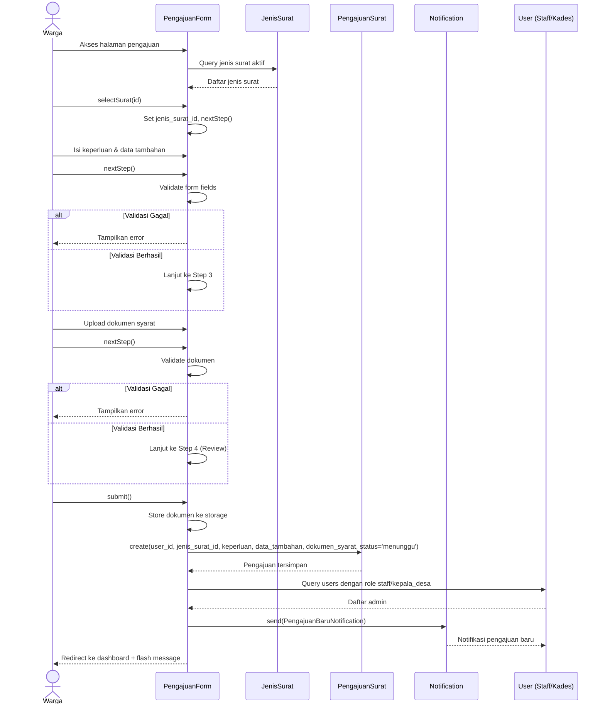
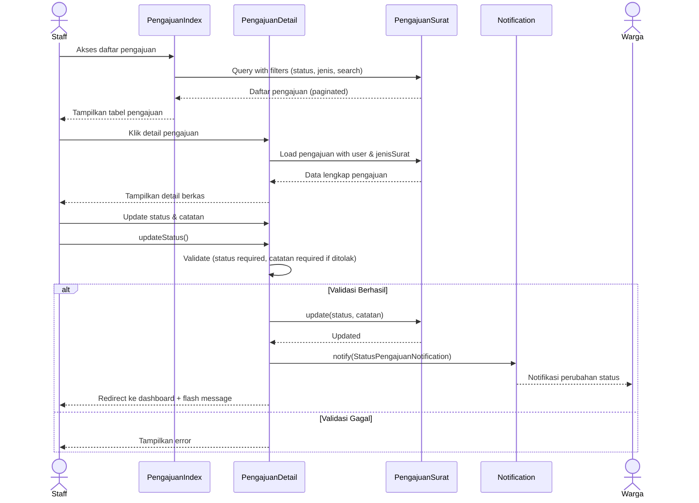
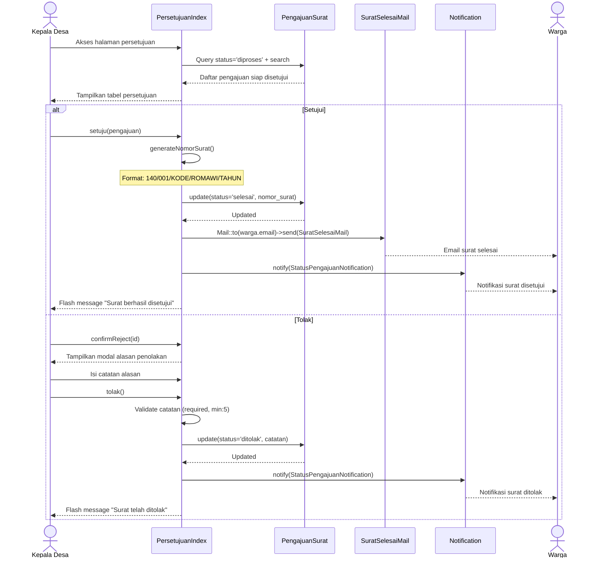
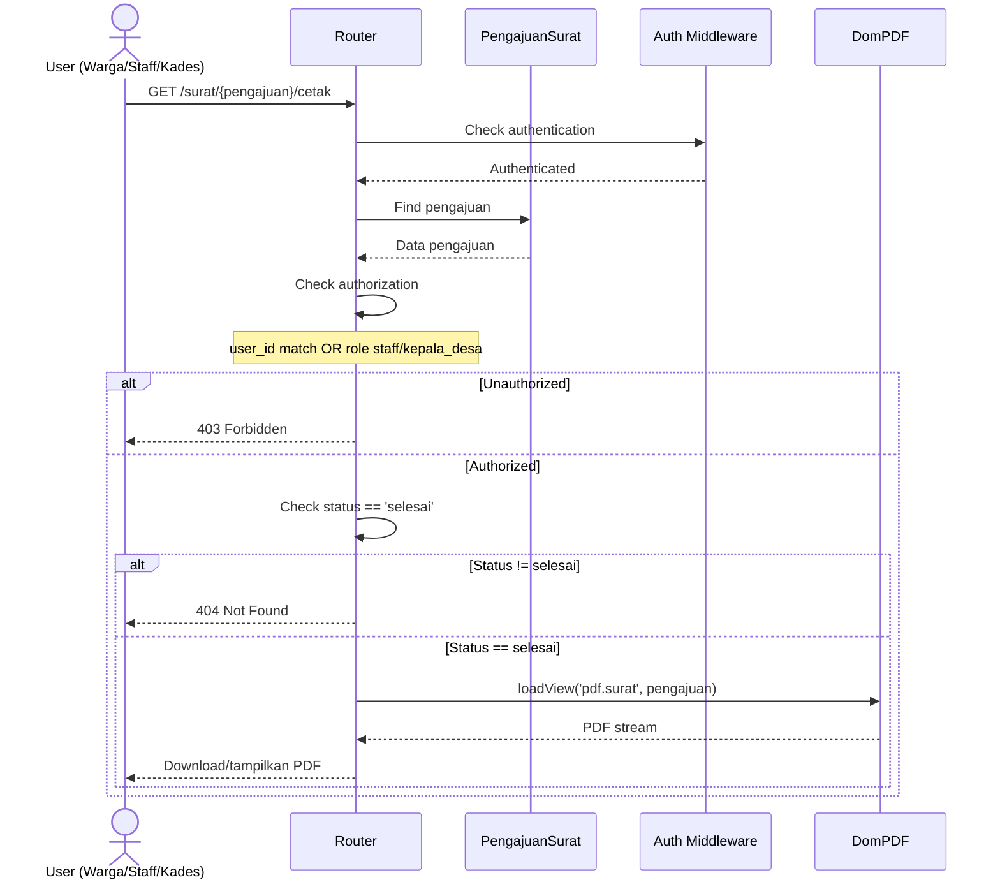
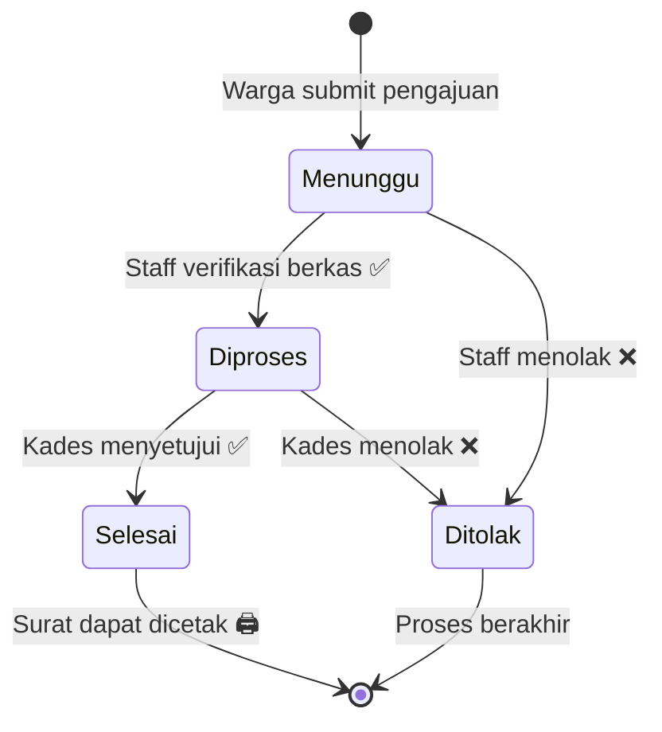

# UML Diagrams — SIMS Desa Pandak Daun
**Sistem Informasi Manajemen Surat (SIMS) Desa Pandak Daun**

> [!NOTE]
> Semua diagram dibuat berdasarkan analisis langsung terhadap kode sumber aplikasi Laravel + Livewire.

---

## 1. Use Case Diagram

```mermaid
graph TB
    subgraph "SIMS Desa Pandak Daun"
        UC1["📝 Register / Daftar Akun"]
        UC2["🔐 Login"]
        UC3["🔓 Logout"]
        UC4["📋 Ajukan Surat"]
        UC5["📜 Lihat Riwayat Pengajuan"]
        UC6["👤 Kelola Profil"]
        UC7["🖨️ Cetak Surat"]
        UC8["📬 Lihat Daftar Pengajuan Masuk"]
        UC9["✅ Verifikasi Berkas Pengajuan"]
        UC10["📂 Kelola Master Jenis Surat"]
        UC11["👥 Lihat Data Warga"]
        UC12["📊 Lihat Laporan"]
        UC13["🖨️ Cetak Laporan PDF"]
        UC14["✅ Setujui Pengajuan"]
        UC15["❌ Tolak Pengajuan"]
        UC16["👥 Kelola Pengguna"]
        UC17["🔑 Kelola Role & Hak Akses"]
        UC18["📩 Terima Notifikasi"]
        UC19["📧 Kirim Email Surat Selesai"]
        UC20["📊 Lihat Dashboard"]
    end

    Warga["🧑 Warga"]
    Staff["👨‍💼 Staff Desa"]
    Kades["👨‍⚖️ Kepala Desa"]

    Warga --> UC1
    Warga --> UC2
    Warga --> UC3
    Warga --> UC4
    Warga --> UC5
    Warga --> UC6
    Warga --> UC7
    Warga --> UC18
    Warga --> UC20

    Staff --> UC2
    Staff --> UC3
    Staff --> UC8
    Staff --> UC9
    Staff --> UC10
    Staff --> UC11
    Staff --> UC12
    Staff --> UC13
    Staff --> UC18
    Staff --> UC20

    Kades --> UC2
    Kades --> UC3
    Kades --> UC14
    Kades --> UC15
    Kades --> UC16
    Kades --> UC17
    Kades --> UC12
    Kades --> UC13
    Kades --> UC18
    Kades --> UC19
    Kades --> UC20

    UC9 -.->|"<<include>>"| UC18
    UC14 -.->|"<<include>>"| UC18
    UC14 -.->|"<<include>>"| UC19
    UC15 -.->|"<<include>>"| UC18
    UC4 -.->|"<<include>>"| UC18
```

### Deskripsi Aktor

| Aktor | Deskripsi |
|-------|-----------|
| **Warga** | Penduduk Desa Pandak Daun yang mengajukan surat administrasi |
| **Staff Desa** | Petugas administrasi yang memverifikasi berkas pengajuan |
| **Kepala Desa** | Pejabat yang menyetujui/menolak pengajuan surat |

### Deskripsi Use Case

| # | Use Case | Deskripsi |
|---|----------|-----------|
| UC1 | Register / Daftar Akun | Warga mendaftar akun dengan NIK, data pribadi, alamat, dan email |
| UC2 | Login | Pengguna masuk ke sistem menggunakan kredensial |
| UC3 | Logout | Pengguna keluar dari sistem |
| UC4 | Ajukan Surat | Warga mengajukan surat melalui form multi-step (pilih jenis → isi form → upload dokumen → konfirmasi) |
| UC5 | Lihat Riwayat Pengajuan | Warga melihat daftar pengajuan yang pernah dibuat beserta statusnya |
| UC6 | Kelola Profil | Warga mengedit data profil (nama, NIK, telepon, alamat, email) |
| UC7 | Cetak Surat | Warga/Staff/Kades mencetak surat yang sudah berstatus "selesai" dalam format PDF |
| UC8 | Lihat Daftar Pengajuan Masuk | Staff melihat semua pengajuan yang masuk dengan filter status & jenis surat |
| UC9 | Verifikasi Berkas Pengajuan | Staff memverifikasi kelengkapan berkas dan mengubah status pengajuan |
| UC10 | Kelola Master Jenis Surat | Staff menambah, mengedit, atau menonaktifkan jenis surat beserta syarat & form fields |
| UC11 | Lihat Data Warga | Staff melihat daftar data penduduk yang terdaftar |
| UC12 | Lihat Laporan | Staff/Kades melihat laporan pengajuan berdasarkan filter periode, status, dan jenis surat |
| UC13 | Cetak Laporan PDF | Staff/Kades mencetak laporan rekap pengajuan dalam format PDF |
| UC14 | Setujui Pengajuan | Kepala Desa menyetujui pengajuan dan sistem generate nomor surat otomatis |
| UC15 | Tolak Pengajuan | Kepala Desa menolak pengajuan disertai catatan alasan penolakan |
| UC16 | Kelola Pengguna | Kepala Desa mengelola pengguna dan mengubah role pengguna |
| UC17 | Kelola Role & Hak Akses | Kepala Desa membuat, mengedit, dan menghapus role beserta permission-nya |
| UC18 | Terima Notifikasi | Pengguna menerima notifikasi terkait perubahan status pengajuan |
| UC19 | Kirim Email Surat Selesai | Sistem mengirim email ke warga ketika surat telah disetujui |
| UC20 | Lihat Dashboard | Pengguna melihat dashboard sesuai role masing-masing |

---

## 2. Class Diagram

```mermaid
classDiagram
    direction TB

    class User {
        +int id
        +string nik
        +string name
        +string email
        +string phone
        +string address
        +string rt
        +string rw
        +string village
        +string district
        +datetime email_verified_at
        +string password
        +string remember_token
        +datetime created_at
        +datetime updated_at
        +pengajuanSurats() HasMany~PengajuanSurat~
        +hasRole(role) bool
        +assignRole(role) void
        +syncRoles(roles) void
        +notify(notification) void
    }

    class JenisSurat {
        +int id
        +string nama
        +string kode
        +string deskripsi
        +string icon
        +json syarat
        +json form_fields
        +bool is_active
        +datetime created_at
        +datetime updated_at
        +pengajuanSurats() HasMany~PengajuanSurat~
    }

    class PengajuanSurat {
        +int id
        +string nomor_surat
        +int user_id
        +int jenis_surat_id
        +string keperluan
        +json data_tambahan
        +json dokumen_syarat
        +enum status
        +string catatan
        +string file_surat_url
        +datetime created_at
        +datetime updated_at
        +user() BelongsTo~User~
        +jenisSurat() BelongsTo~JenisSurat~
    }

    class Role {
        +int id
        +string name
        +string guard_name
        +permissions() BelongsToMany~Permission~
    }

    class Permission {
        +int id
        +string name
        +string guard_name
        +roles() BelongsToMany~Role~
    }

    class Register {
        +int step
        +string nik
        +string name
        +string phone
        +string address
        +string rt
        +string rw
        +string email
        +string password
        +string password_confirmation
        +nextStep() void
        +previousStep() void
        +register() void
        +render() View
    }

    class PengajuanForm {
        +int step
        +int jenis_surat_id
        +string keperluan
        +array data_tambahan
        +array dokumen
        +selectSurat(id) void
        +nextStep() void
        +previousStep() void
        +submit() void
        +render() View
    }

    class RiwayatPengajuan {
        +render() View
    }

    class Profile {
        +string name
        +string email
        +string nik
        +string phone
        +string address
        +string rt
        +string rw
        +string village
        +string district
        +save() void
        +render() View
    }

    class PengajuanIndex {
        +string search
        +string statusFilter
        +string jenisSuratFilter
        +render() View
    }

    class PengajuanDetail {
        +PengajuanSurat pengajuan
        +string status
        +string catatan
        +updateStatus() void
        +render() View
    }

    class MasterSurat {
        +Collection jenisSuratList
        +bool isModalOpen
        +bool isEditMode
        +int surat_id
        +string nama
        +string kode
        +string deskripsi
        +string icon
        +array form_fields
        +openModal(id) void
        +closeModal() void
        +save() void
        +toggleStatus(id) void
        +render() View
    }

    class DataWarga {
        +string search
        +render() View
    }

    class PersetujuanIndex {
        +string search
        +bool showRejectModal
        +int rejectId
        +string catatan
        +setuju(pengajuan) void
        +confirmReject(id) void
        +tolak() void
        +cancelReject() void
        -generateNomorSurat(pengajuan) string
        -getRomawi(bulan) string
        +render() View
    }

    class UserManager {
        +string search
        +string roleFilter
        +User selectedUser
        +string newRole
        +bool showRoleModal
        +openRoleModal(userId) void
        +changeRole() void
        +render() View
    }

    class RoleManager {
        +Collection roles
        +bool showRoleModal
        +bool showPermissionModal
        +int roleId
        +string roleName
        +Role selectedRole
        +array selectedPermissions
        +Collection permissionsList
        +createRole() void
        +editRole(id) void
        +saveRole() void
        +deleteRole(id) void
        +managePermissions(id) void
        +savePermissions() void
        +render() View
    }

    class LaporanIndex {
        +string startDate
        +string endDate
        +string status
        +string jenis_surat_id
        +render() View
    }

    class PengajuanBaruNotification {
        +PengajuanSurat pengajuan
        +via(notifiable) array
        +toDatabase(notifiable) array
    }

    class StatusPengajuanNotification {
        +PengajuanSurat pengajuan
        +via(notifiable) array
        +toDatabase(notifiable) array
    }

    class SuratSelesaiMail {
        +PengajuanSurat pengajuan
        +build() Mailable
    }

    %% ---- Relasi Model ----
    User "1" --> "*" PengajuanSurat : memiliki
    JenisSurat "1" --> "*" PengajuanSurat : memiliki
    User "*" --> "*" Role : memiliki
    Role "*" --> "*" Permission : memiliki

    %% ---- Livewire menggunakan Model ----
    PengajuanForm ..> PengajuanSurat : creates
    PengajuanForm ..> JenisSurat : reads
    PengajuanDetail ..> PengajuanSurat : updates
    PengajuanIndex ..> PengajuanSurat : reads
    MasterSurat ..> JenisSurat : manages
    PersetujuanIndex ..> PengajuanSurat : approves/rejects
    UserManager ..> User : manages
    UserManager ..> Role : reads
    RoleManager ..> Role : manages
    RoleManager ..> Permission : manages
    Register ..> User : creates
    Profile ..> User : updates
    LaporanIndex ..> PengajuanSurat : reads

    %% ---- Notifications ----
    PengajuanForm ..> PengajuanBaruNotification : sends
    PengajuanDetail ..> StatusPengajuanNotification : sends
    PersetujuanIndex ..> StatusPengajuanNotification : sends
    PersetujuanIndex ..> SuratSelesaiMail : sends
```

### Keterangan Relasi

| Relasi | Tipe | Deskripsi |
|--------|------|-----------|
| User → PengajuanSurat | One-to-Many | Satu warga bisa memiliki banyak pengajuan surat |
| JenisSurat → PengajuanSurat | One-to-Many | Satu jenis surat bisa digunakan banyak pengajuan |
| User ↔ Role | Many-to-Many | Satu user bisa punya banyak role (via Spatie) |
| Role ↔ Permission | Many-to-Many | Satu role bisa punya banyak permission (via Spatie) |

---

## 3. Activity Diagram

### Alur Pengajuan Surat (End-to-End)

### Alur Kelola Master Jenis Surat (Staff)

---

## 4. Sequence Diagram

### Proses Pengajuan Surat oleh Warga

### Proses Verifikasi oleh Staff

### Proses Persetujuan oleh Kepala Desa

### Proses Cetak Surat PDF

---

## Ringkasan Status Pengajuan

| Status | Deskripsi | Dilakukan Oleh |
|--------|-----------|----------------|
| `menunggu` | Pengajuan baru masuk, belum diverifikasi | Sistem (saat warga submit) |
| `diproses` | Berkas sudah diverifikasi staff, menunggu persetujuan Kades | Staff |
| `selesai` | Surat disetujui oleh Kepala Desa, nomor surat di-generate | Kepala Desa |
| `ditolak` | Pengajuan ditolak (oleh Staff atau Kades) disertai catatan | Staff / Kepala Desa |
